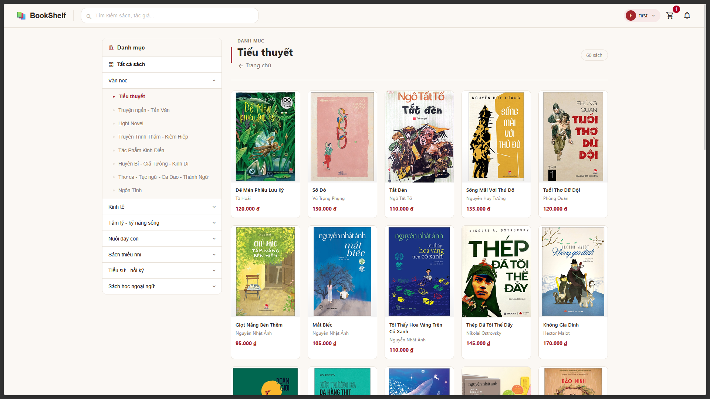
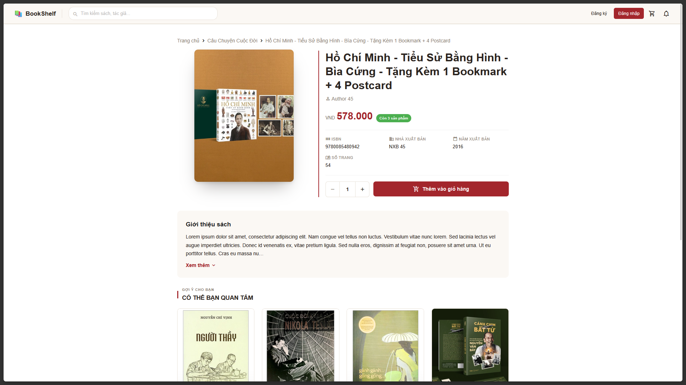
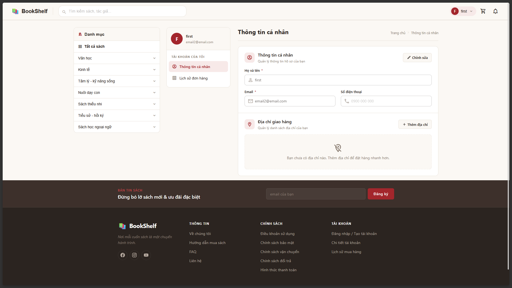
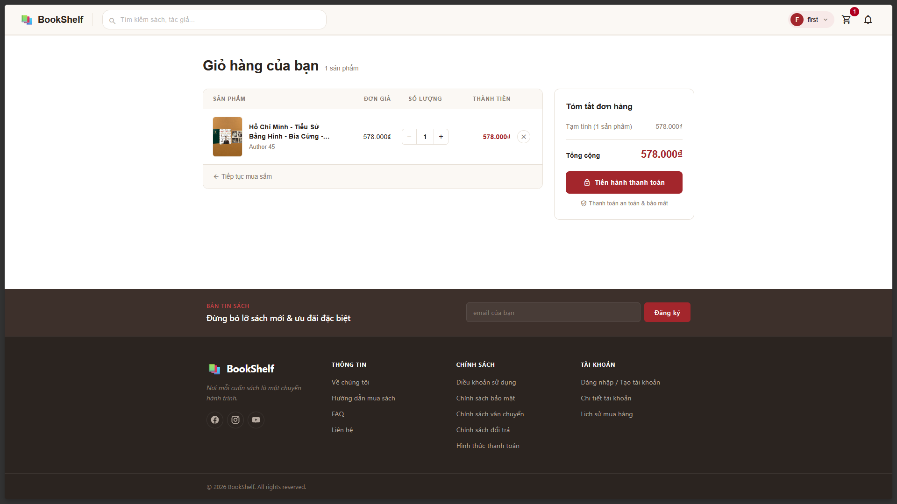
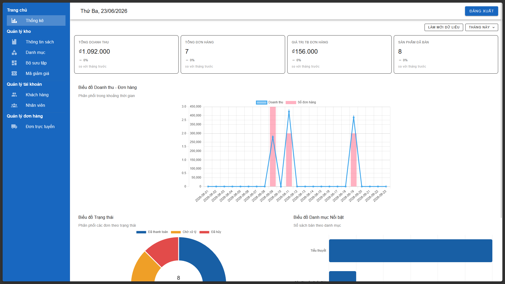

# Full-stack Book Ecommerce Website

Goal: functional website for a small book store with 1-2 employees + owner. Nothing fancy. My goal is to keep the stack as minimal and budget as tight as possible.

- Frontend: Vue 3 (JavaScript) + Vuetify + Chartjs
- Backend: Spring Boot (Java)
- Database: PostgreSQL

Implemented: Book, Order, Cart, Categories, Collections. Online payment with VNPAY sandbox. Upload image with Cloudinary. Integration with Google OAuth 2.0. Email sender with Spring mail. Analytics Dashboard with Postgres Materialized View.

AI Usage: Only for frontend beautifying, all those lengthy CSS snippets are from Claude. Every other logic flows are handwritten, so it might be unexpectedly brittle (lmao).

## Screenshots


*Landing Page*



*Book Grid View By Categories*



*Book Details View*



*User Profile View*



*Cart View*



*Admin Dashboard View*

## Project Local Setup

Pre-requisites: **JDK 21; Node 20; Docker (or Podman)**

Add these environment variables (add in terminal session, or add them into IntelliJ IDEA run configurations)

- Google OAuth: make new Google project and register oauth.

```bash
GOOGLE_CLIENT_ID=$client_id
GOOGLE_CLIENT_SECRET=$client_secret
GOOGLE_RETURN_URI=$return_uri
GOOGLE_SCOPE=openid,email,profile;
```

- Cloudinary: Cloud storage for images

```bash
CLOUDINARY_URL=cloudinary://...
```

- Mail client: sending forget password email (register an app password for a gmail account prior to this)

```bash
MAIL_PASSWORD=$password
MAIL_USERNAME=$username
```

- Postgres

```bash
POSTGRES_USERNAME=$username
POSTGRES_PASSWORD=$password
POSTGRES_DATASOURCE_URL=$datasource
```

- VNPay sandbox: register merchange test account prior to this.

``` bash
COMMAND=pay
ORDER_TYPE=150000;
PAY_URL=https://sandbox.vnpayment.vn/paymentv2/vpcpay.html;
RETURN_URL=$return_url
SECRET_KEY=$secret_key;
TMN_CODE=$tmn_code;
VERSION=2.1.0;
```

- Other Spring related:

```bash
SPRING_PROFILES_ACTIVE=local
FRONTEND_URL=http://localhost:5173
```

Run `docker-compose.yaml` in the root directory. Mock tables and data is in `backup.sql` file, it will be run automatically on entrypoint script. 

Backend = `bookstore` directory, using Maven. Frontend = `frontend` directory, run with `npm`.

## Deployment

This project was deployed at domain `bookshelfdatn.io.vn` (INETvn). Nginx reverse proxy serves Vue3 static files, backend is single jar file and database is a Postgresql Podman container (as systemd unit), everything is inside Google Compute `e2-micro` VM.

Core functionalities were tight, no bugs (at least from my tests). VNPay checkout and Google Oauth login worked as intended.

## References

- Website design references
	- https://vuasachcu.com/
	- https://www.vinabook.com/
	- https://gacxepbookstore.vn/
	- https://www.fahasa.com/
- How to compile LaTeX on local: https://www.youtube.com/watch?v=Mty0vHb0knI
- Vuetify ref doc: https://vuetifyjs.com/en/